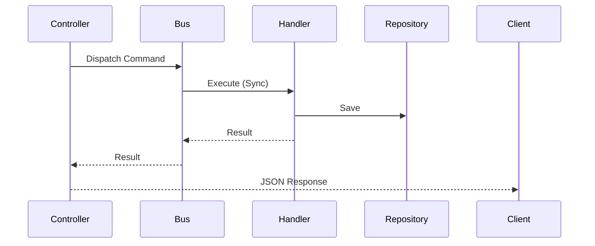
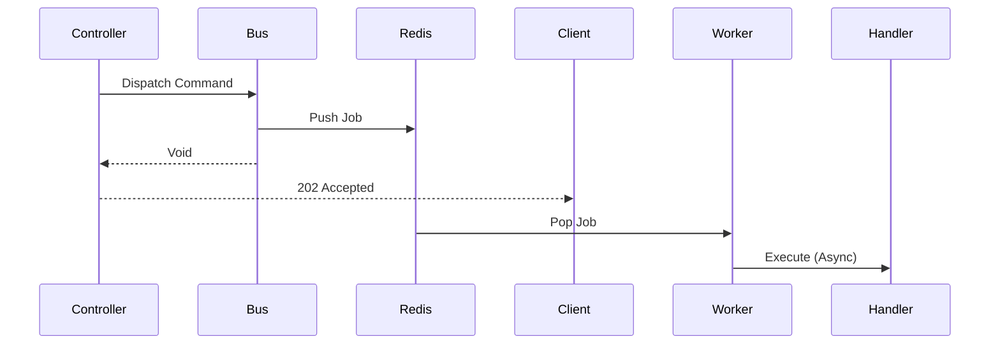

# DBA DDD Skeleton

[](https://packagist.org/packages/dbravoan/dba-ddd-skeleton)
[](https://packagist.org/packages/dbravoan/dba-ddd-skeleton)
[](https://packagist.org/packages/dbravoan/dba-ddd-skeleton)

Este paquete proporciona una estructura robusta y herramientas para implementar **Domain-Driven Design (DDD)** y **Arquitectura Hexagonal** en aplicaciones Laravel de forma modular y desacoplada.

Está diseñado para ser instalado como una dependencia (`composer require`) en tu proyecto Laravel, proporcionando las capas base, abstracciones y comandos necesarios para construir módulos de dominio sin reinventar la rueda.

> "No inyectes lógica de negocio en tus controladores. No acoples tu dominio a tu framework."

Este paquete no es solo una colección de archivos; es una propuesta arquitectónica diseñada para resolver los problemas comunes en proyectos Laravel que crecen descontroladamente: *Fat Controllers, Modelos gigantes y lógica dispersa*.

---

## 📚 Introducción Teórica

### ¿Por qué complicarnos la vida?

En un proyecto pequeño (CRUD), el patrón MVC estándar de Laravel es perfecto. Pero cuando la lógica de negocio crece, surgen problemas:

1. **Acoplamiento**: Tu lógica de negocio depende de Eloquent, de las Requests HTTP y del Framework. Si mañana quieres cambiar algo, sufres.
2. **Testabilidad**: Para testear una regla de negocio simple, necesitas levantar todo el framework (Feature Tests lentos) en lugar de testear la clase aislada (Unit Tests rápidos).
3. **Mantenibilidad**: ¿Dónde está la lógica de "Calcular Precio con Descuento"? ¿En el Modelo? ¿En el Controlador? ¿En un Helper?

### La Solución: Capas Concéntricas

Este esqueleto propone dividir tu código en tres capas con responsabilidades claras y estrictas:

1. **Dominio (`Domain`)**:
    - *Qué es*: El núcleo de tu negocio. Clases PHP puras. Entidades, Value Objects, Interfaces de Repositorio.
    - *Regla de Oro*: **Cero dependencias del framework**. Aquí no existe `Illuminate\` ni `Eloquent`.

2. **Aplicación (`Application`)**:
    - *Qué es*: Los casos de uso de tu sistema. "Crear Usuario", "Buscar Producto", "Aplicar Descuento".
    - *Cómo funciona*: Recibe una petición (DTO), orquesta las entidades del Dominio y persiste los cambios usando Interfaces.
    - *Estructura*: Bus de Comandos (Command/Query + Handler) o Servicios de Aplicación.

3. **Infraestructura (`Infrastructure`)**:
    - *Qué es*: El mundo real. La implementación técnica.
    - *Componentes*: Controladores HTTP, Implementaciones de Repositorios (Eloquent), Colas (Redis), APIs externas.
    - *Responsabilidad*: Conectar el mundo exterior con tu capa de Aplicación.

---

## 🚀 Características

- **Separación Estricta de Capas**: Domain, Application e Infrastructure.
- **Generadores de Código**: Comandos `artisan` para crear módulos completos con un solo comando.
- **Criteria Pattern**: Sistema de filtros, ordenación y paginación avanzado y desacoplado de Eloquent.
- **Bus de Mensajes**: Abstracciones para Command Bus y Query Bus (síncrono y asíncrono).
- **Repositorios**: Interfaces y contratos para desacoplar la persistencia.
- **Value Objects**: Primitivos de dominio listos para usar (Uuid, Email, etc.).

---

## 📦 Instalación

Requiere el paquete en tu proyecto Laravel:

```bash
composer require dbravoan/dba-ddd-skeleton
```

### Publicar Configuración (Opcional)

Si necesitas personalizar los stubs (plantillas de código) que usa el generador:

```bash
php artisan vendor:publish --tag=dba-ddd-skeleton-stubs
```

---

## 🛠️ Configuración Inicial

### 1. Estructura de Directorios

Por defecto, este paquete asume que tu código de dominio vivirá en `src/`, fuera de la carpeta `app/` estándar de Laravel, para mantenerlo agnóstico al framework.

Asegúrate de configurar tu `composer.json` para cargar las clases desde `src/`.

**Ejemplo `composer.json`:**

```json
"autoload": {
    "psr-4": {
        "App\\": "app/",
        "MyCompany\\Context\\": "src/Context/"
    }
}
```

*Recuerda ejecutar `composer dump-autoload` después de cambiar esto.*

### 2. Service Provider

El paquete incluye un `DddSkeletonServiceProvider` que se auto-descubre. Si necesitas registrar bindings manuales de repositorios, te recomendamos crear un `ContextServiceProvider` en tu aplicación.

---

## 💡 Uso: Creando un Nuevo Módulo

La funcionalidad estrella de este paquete es el generador de módulos. Olvida crear carpetas y archivos a mano.

Ejecuta el siguiente comando para crear un nuevo módulo (ej: `Product` dentro del contexto `Catalog`):

```bash
# php artisan dba:make:module <Contexto> <Modulo>
php artisan dba:make:module Catalog Product
```

Esto generará automáticamente la siguiente estructura en `src/Catalog/Product`:

```text
src/Catalog/Product/
├── Application/
│   ├── Create/      # Casos de uso de creación (Command + Handler)
│   ├── Find/        # Casos de uso de búsqueda (Query + Handler + Response)
│   ├── Search/      # Búsqueda por criterios
│   └── ...
├── Domain/
│   ├── Product.php              # Entidad / Agregado
│   ├── ProductId.php            # Value Object
│   ├── ProductRepository.php    # Interfaz del Repositorio
│   └── ...
└── Infrastructure/
    ├── Persistence/
    │   └── EloquentProductRepository.php  # Implementación Eloquent
    └── Controller/
        └── CreateProductController.php    # Controlador API
```

### Inyección de Dependencias

Para que Laravel sepa qué implementación usar cuando inyectas una interfaz de dominio, debes hacer el binding en un ServiceProvider (por ejemplo `app/Providers/AppServiceProvider.php` o uno dedicado):

```php
use Catalog\Product\Domain\ProductRepository;
use Catalog\Product\Infrastructure\Persistence\EloquentProductRepository;

public function register(): void
{
    $this->app->bind(
        ProductRepository::class,
        EloquentProductRepository::class
    );
}
```

---

## 🏗️ Anatomía de un Caso de Uso (Ej: Crear Producto)

Veamos el flujo de datos completo para entender el desacoplamiento:

1. **El Controlador (`Infrastructure`)**
    Recibe el Request HTTP. Su única misión es extraer los datos, encapsularlos en un DTO (*Command*) y despacharlos al Bus.

    ```php
    public function __invoke(Request $request): JsonResponse {
        $command = new CreateProductCommand($request->input('name')...);
        $this->bus->dispatch($command); // Desacoplamiento total
        return response()->json(..., 201);
    }
    ```

2. **El Comando (`Application`)**
    Es un DTO (Data Transfer Object) inmutable. Solo transporta datos, no tiene lógica.

    ```php
    final class CreateProductCommand {
        public function __construct(private string $name) {}
        public function name(): string { return $this->name; }
    }
    ```

3. **El Manejador (`Application`)**
    Recibe el Comando y ejecuta la lógica. Orquesta el dominio.

    ```php
    final class CreateProductCommandHandler {
        public function __construct(private ProductRepository $repository) {}
        
        public function __invoke(CreateProductCommand $command): void {
            $product = Product::create(new ProductId(...), new ProductName(...));
            $this->repository->save($product);
        }
    }
    ```

    *Nota: Aquí usamos la interfaz `ProductRepository`, no Eloquent directamente. Esto nos permite testear este Handler con un MockRepository sin tocar la base de datos.*

4. **El Repositorio (`Infrastructure`)**
    La implementación real que habla con la base de datos.

    ```php
    final class EloquentProductRepository implements ProductRepository {
        public function save(Product $product): void {
            EloquentModel::updateOrCreate(..., $product->toPrimitives());
        }
    }
    ```

---

## 🔍 Patrón Criteria: Búsquedas Flexibles

El módulo genera automáticamente un sistema de búsqueda potente capaz de interpretar filtros complejos, ordenación y paginación desde la Query String.

### Estructura de la Petición

El sistema soporta dos modos de filtrado: **Simple** (compatible hacia atrás) y **Avanzado** (Grupos y Condiciones anidadas).

#### 1. Modo Simple (Flat)

Ideal para filtros rápidos con `AND`.

`GET /products?filters[0][field]=name&filters[0][operator]=CONTAINS&filters[0][value]=Mesa`

#### 2. Modo Avanzado (Grupos y Lógica Booleana)

Permite construir consultas complejas con paréntesis, `AND` y `OR`.

**Ejemplo: (Fecha >= 2025 AND Fecha <= 2026) OR (CreadoPor = AFSantos)**

```
filters[groups][0][glue]=AND
filters[groups][0][conditions][0][field]=created_at
filters[groups][0][conditions][0][operator]=>=
filters[groups][0][conditions][0][value]=2025-01-01
filters[groups][0][conditions][1][field]=created_at
filters[groups][0][conditions][1][operator]=<=
filters[groups][0][conditions][1][value]=2026-01-01

filters[groups][1][glue]=OR
filters[groups][1][conditions][0][field]=created_by
filters[groups][1][conditions][0][operator]==
filters[groups][1][conditions][0][value]=AFSantos

glue=AND (Pegamento entre los grupos principales)
```

### Mapeo Interno

1. **RequestCriteriaBuilder**: Intercepta la `Request`, decodifica el JSON de `filters` y construye un objeto de valor `Criteria` inmutable.
2. **Criteria Pass**: Este objeto viaja desde el Controller -> Query -> Handler -> Searcher -> Repository.
3. **Eloquent Converter**: En la infraestructura, el repositorio convierte `Criteria` a sentencias SQL.

```php
// En tu Controlador
$criteria = $this->requestCriteriaBuilder->buildFromRequest($request);
// $criteria ahora contiene objetos de dominio Filter, Order, etc. desacoplados de HTTP.
```

---

## 🧠 Arquitectura del Bus: Síncrono vs Asíncrono

Una de las joyas de esta arquitectura es la **transparencia de ubicación**. Tu lógica de negocio (Handler) no sabe *dónde* ni *cuándo* se ejecuta.

### Modo Síncrono (Servicio de Aplicación)

Por defecto, cuando despachas un comando, el Bus busca el Handler y lo ejecuta inmediatamente en el mismo proceso PHP.

**Caso de Uso**: Crear un usuario y devolver su ID en la respuesta HTTP.



### Modo Asíncrono (Colas y Workers)

¿Qué pasa si "Generar Reporte PDF" tarda 10 segundos? No queremos bloquear al usuario.
Gracias al Bus, **no cambias ni una línea de tu lógica**. Solo marcas el Comando con la interfaz `ShouldQueue`.

```php
use Illuminate\Contracts\Queue\ShouldQueue;

final class GenerateReportCommand implements ShouldQueue { ... }
```

**Flujo Asíncrono:**

1. Laravel detecta `ShouldQueue`.
2. En lugar de llamar al Handler, serializa el Comando y lo envía a **Redis** (o tu driver de colas).
3. El Controlador responde "202 Accepted" inmediatamente.
4. Un proceso **Worker (Supervisor)** en segundo plano recoge el comando y ejecuta el Handler.



**Beneficios:**

- **Resiliencia**: Si falla, el Worker reintenta automáticamente.
- **Escalabilidad**: Puedes tener 50 workers procesando reportes en otro servidor.
- **Experiencia de Usuario**: Respuestas en milisegundos, tareas pesadas en background.

---

## 🧠 Glosario Rápido

- **Bounded Context**: Límite lógico de un subsistema (ej: "Facturación", "Catálogo").
- **Aggregates**: Conjunto de entidades que se tratan como una unidad (ej: Producto + Variantes).
- **Value Objects**: Objetos que se identifican por su valor, no por ID (ej: Email, Precio, Coordenada). Son inmutables.
- **DTO (Data Transfer Object)**: Objeto simple para mover datos entre capas (Commands/Queries).

---

## Licencia

Este paquete es software open-source bajo licencia [MIT](LICENSE).
