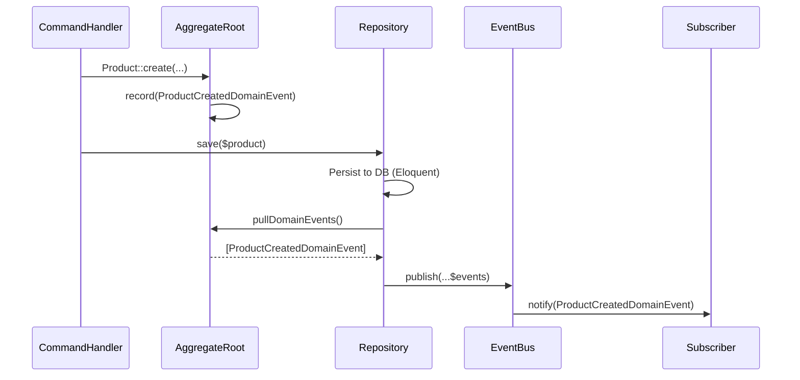
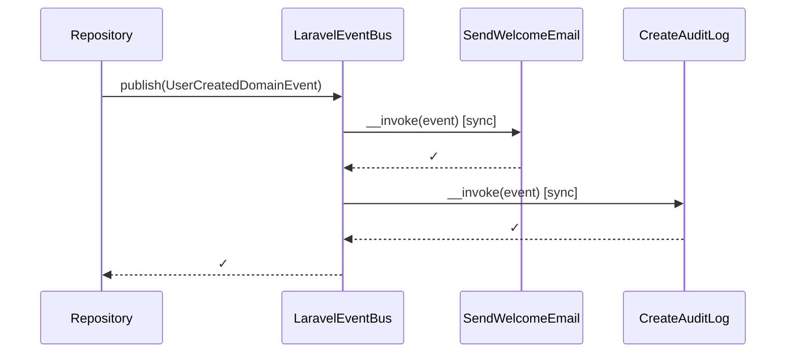
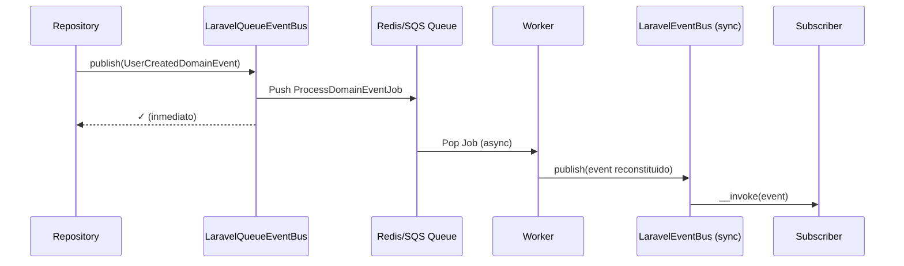
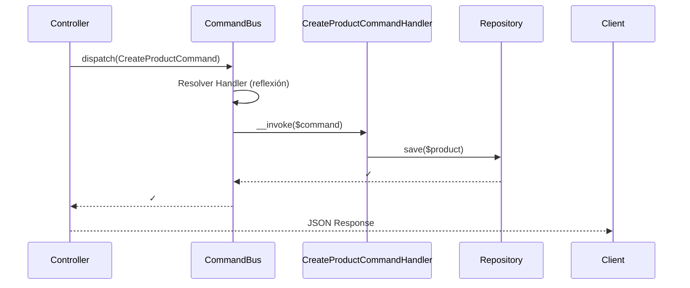

# DBA DDD Skeleton

[](https://packagist.org/packages/dbravoan/dba-ddd-skeleton)
[](https://packagist.org/packages/dbravoan/dba-ddd-skeleton)
[](https://packagist.org/packages/dbravoan/dba-ddd-skeleton)

Este paquete proporciona una estructura robusta y herramientas para implementar **Domain-Driven Design (DDD)** y **Arquitectura Hexagonal** en aplicaciones Laravel de forma modular y desacoplada.

Está diseñado para ser instalado como una dependencia (`composer require`) en tu proyecto Laravel, proporcionando las capas base, abstracciones y comandos necesarios para construir módulos de dominio sin reinventar la rueda.

> "No inyectes lógica de negocio en tus controladores. No acoples tu dominio a tu framework."

Este paquete no es solo una colección de archivos; es una propuesta arquitectónica diseñada para resolver los problemas comunes en proyectos Laravel que crecen descontroladamente: *Fat Controllers, Modelos gigantes y lógica dispersa*.

---

## 📚 Introducción Teórica

### ¿Por qué complicarnos la vida?

En un proyecto pequeño (CRUD), el patrón MVC estándar de Laravel es perfecto. Pero cuando la lógica de negocio crece, surgen problemas:

1. **Acoplamiento**: Tu lógica de negocio depende de Eloquent, de las Requests HTTP y del Framework. Si mañana quieres cambiar algo, sufres.
2. **Testabilidad**: Para testear una regla de negocio simple, necesitas levantar todo el framework (Feature Tests lentos) en lugar de testear la clase aislada (Unit Tests rápidos).
3. **Mantenibilidad**: ¿Dónde está la lógica de "Calcular Precio con Descuento"? ¿En el Modelo? ¿En el Controlador? ¿En un Helper?

### La Solución: Capas Concéntricas

Este esqueleto propone dividir tu código en tres capas con responsabilidades claras y estrictas:

1. **Dominio (`Domain`)**:
    - *Qué es*: El núcleo de tu negocio. Clases PHP puras. Entidades, Value Objects, Interfaces de Repositorio.
    - *Regla de Oro*: **Cero dependencias del framework**. Aquí no existe `Illuminate\` ni `Eloquent`.

2. **Aplicación (`Application`)**:
    - *Qué es*: Los casos de uso de tu sistema. "Crear Usuario", "Buscar Producto", "Aplicar Descuento".
    - *Cómo funciona*: Recibe una petición (DTO), orquesta las entidades del Dominio y persiste los cambios usando Interfaces.
    - *Estructura*: Bus de Comandos (Command/Query + Handler) o Servicios de Aplicación.

3. **Infraestructura (`Infrastructure`)**:
    - *Qué es*: El mundo real. La implementación técnica.
    - *Componentes*: Controladores HTTP, Implementaciones de Repositorios (Eloquent), Colas (Redis), APIs externas.
    - *Responsabilidad*: Conectar el mundo exterior con tu capa de Aplicación.

---

## 🚀 Características

- **Separación Estricta de Capas**: Domain, Application e Infrastructure.
- **Generadores de Código**: Comandos `artisan` para crear módulos completos con un solo comando.
- **Domain Events**: Publicación automática de eventos de dominio desde el repositorio. Tu lógica nunca se olvida de publicar.
- **Criteria Pattern**: Sistema de filtros, ordenación y paginación avanzado y desacoplado de Eloquent.
- **Bus de Mensajes**: Abstracciones para Command Bus, Query Bus y Event Bus con implementaciones nativas de Laravel.
- **Repositorios**: Interfaces y contratos para desacoplar la persistencia.
- **Value Objects**: Primitivos de dominio listos para usar (Uuid, Email, etc.).

---

## 📦 Instalación

Requiere el paquete en tu proyecto Laravel:

```bash
composer require dbravoan/dba-ddd-skeleton
```

### Publicar Configuración (Opcional)

Si necesitas personalizar los stubs (plantillas de código) que usa el generador:

```bash
php artisan vendor:publish --tag=dba-ddd-skeleton-stubs
```

---

## 🛠️ Configuración Inicial

### 1. Estructura de Directorios

Por defecto, este paquete asume que tu código de dominio vivirá en `src/`, fuera de la carpeta `app/` estándar de Laravel, para mantenerlo agnóstico al framework.

Asegúrate de configurar tu `composer.json` para cargar las clases desde `src/`.

**Ejemplo `composer.json`:**

```json
"autoload": {
    "psr-4": {
        "App\\": "app/",
        "MyCompany\\Context\\": "src/Context/"
    }
}
```

*Recuerda ejecutar `composer dump-autoload` después de cambiar esto.*

### 2. Service Provider

El paquete incluye un `DddSkeletonServiceProvider` que se auto-descubre. Registra automáticamente:

- **`CommandBus`** → `LaravelCommandBus` (síncrono, reflexión)
- **`QueryBus`** → `LaravelQueryBus` (síncrono, reflexión)
- **`EventBus`** → `LaravelEventBus` (síncrono, sobreescribible a async)

Para registrar tus propios handlers y repositorios, consulta la sección **[Service Providers](#-service-providers-organización-del-contenedor)**.

### 3. Qué incluye el Paquete

```text
Shared/
├── Domain/
│   ├── Aggregate/       AggregateRoot (record, pullDomainEvents)
│   ├── Bus/
│   │   ├── Command/     Command, CommandBus, CommandHandler (interfaces)
│   │   ├── Event/       DomainEvent, EventBus, DomainEventSubscriber (interfaces)
│   │   └── Query/       Query, QueryBus, QueryHandler, Response (interfaces)
│   ├── Criteria/        Criteria, Filters, FilterGroup, Order (pattern completo)
│   ├── Security/        SqlInjectionProtector
│   └── ValueObject/     Uuid, StringValueObject, IntValueObject, etc.
├── Infrastructure/
│   ├── Bus/
│   │   ├── Command/     LaravelCommandBus, CommandNotRegisteredError
│   │   ├── Event/
│   │   │   └── Laravel/ LaravelEventBus, LaravelQueueEventBus, ProcessDomainEventJob
│   │   └── Query/       LaravelQueryBus, QueryNotRegisteredError
│   ├── Criteria/        RequestCriteriaBuilder
│   ├── Laravel/         ApiController, Providers/RepositoryServiceProvider
│   └── Persistence/
│       ├── Eloquent/    EloquentRepository, EloquentCriteriaConverter
│       └── QueryBuilder/ QueryBuilderRepository, QueryBuilderCriteriaConverter
└── Console/
    └── Commands/        MakeModuleCommand + 25 stubs
```

---

## 💡 Uso: Creando un Nuevo Módulo

La funcionalidad estrella de este paquete es el generador de módulos. Olvida crear carpetas y archivos a mano.

Ejecuta el siguiente comando para crear un nuevo módulo (ej: `Product` dentro del contexto `Catalog`):

```bash
# php artisan dba:make:module <Contexto> <Modulo>
php artisan dba:make:module Catalog Product
```

Esto generará automáticamente la siguiente estructura en `src/Catalog/Product`:

```text
src/Catalog/Product/
├── Application/
│   ├── Create/          # Caso de uso de creación (Command + Handler)
│   ├── Delete/          # Caso de uso de borrado
│   ├── Find/            # Caso de uso de búsqueda (Query + Handler)
│   ├── Response/        # DTOs de respuesta (Response + Responses)
│   ├── SearchByCriteria/# Búsqueda y conteo por criterios
│   └── Update/          # Caso de uso de actualización
├── Domain/
│   ├── Product.php                     # Entidad / Agregado
│   ├── ProductCreatedDomainEvent.php   # Evento de dominio
│   ├── ProductId.php                   # Value Object
│   ├── ProductName.php                 # Value Object
│   └── ProductRepository.php          # Interfaz del Repositorio
└── Infrastructure/
    ├── Controller/
    │   ├── CreateProductController.php
    │   ├── DeleteProductController.php
    │   ├── FindProductController.php
    │   ├── UpdateProductController.php
    │   └── SearchProductsByCriteriaController.php
    └── Persistence/
        └── EloquentProductRepository.php
```

### Inyección de Dependencias

Para que Laravel sepa qué implementación usar cuando inyectas una interfaz de dominio, debes hacer el binding en un ServiceProvider. Consulta la sección **[Service Providers](#-service-providers-organización-del-contenedor)** para ver cómo crear un `RepositoryServiceProvider` y un `DomainServiceProvider` dedicados.

---

## 🏗️ Anatomía de un Caso de Uso (Ej: Crear Producto)

Veamos el flujo de datos completo para entender el desacoplamiento:

1. **El Controlador (`Infrastructure`)**
    Recibe el Request HTTP. Su única misión es extraer los datos, encapsularlos en un DTO (*Command*) y despacharlos al Bus.

    ```php
    public function __invoke(Request $request): JsonResponse {
        $command = new CreateProductCommand($request->input('name')...);
        $this->bus->dispatch($command); // Desacoplamiento total
        return response()->json(..., 201);
    }
    ```

2. **El Comando (`Application`)**
    Es un DTO (Data Transfer Object) inmutable. Solo transporta datos, no tiene lógica.

    ```php
    final class CreateProductCommand {
        public function __construct(private string $name) {}
        public function name(): string { return $this->name; }
    }
    ```

3. **El Manejador (`Application`)**
    Recibe el Comando y ejecuta la lógica. Orquesta el dominio.

    ```php
    final class CreateProductCommandHandler {
        public function __construct(private ProductRepository $repository) {}
        
        public function __invoke(CreateProductCommand $command): void {
            $product = Product::create(new ProductId(...), new ProductName(...));
            $this->repository->save($product);
        }
    }
    ```

    *Nota: Aquí usamos la interfaz `ProductRepository`, no Eloquent directamente. Esto nos permite testear este Handler con un MockRepository sin tocar la base de datos.*

4. **El Repositorio (`Infrastructure`)**
    La implementación real que habla con la base de datos. Además, **publica automáticamente los eventos de dominio** tras persistir el agregado.

    ```php
    final class EloquentProductRepository extends EloquentRepository implements ProductRepository {
        public function save(Product $product): void {
            $this->model->updateOrCreate(
                ['id' => $product->id()->value()],
                $product->toPrimitives()
            );

            // Publica automáticamente los Domain Events grabados en el agregado
            $this->publishEvents($product);
        }
    }
    ```

---

## 📣 Domain Events: Publicación Automática

Los Domain Events son la forma en que un agregado comunica que algo ha ocurrido en el dominio. Este skeleton implementa el patrón de forma **automática y transparente** desde la capa de infraestructura.

### Flujo Completo


```mermaid
sequenceDiagram
    participant H as CommandHandler
    participant A as AggregateRoot
    participant R as Repository
    participant EB as EventBus
    participant S as Subscriber

    H->>A: Product::create(...)
    A->>A: record(ProductCreatedDomainEvent)
    H->>R: save($product)
    R->>R: Persist to DB (Eloquent)
    R->>A: pullDomainEvents()
    A-->>R: [ProductCreatedDomainEvent]
    R->>EB: publish(...$events)
    EB->>S: notify(ProductCreatedDomainEvent)
```

### ¿Cómo funciona?

1. **El Agregado graba eventos** — Al ejecutar una acción de dominio (ej: `Product::create()`), la entidad llama internamente a `$this->record(new ProductCreatedDomainEvent(...))`. Los eventos se acumulan en memoria.

2. **El Repositorio publica** — Tras persistir el agregado, el repositorio llama a `$this->publishEvents($product)`. Este método (heredado de `EloquentRepository`) hace `pullDomainEvents()` del agregado y los envía al `EventBus`.

3. **El EventBus despacha** — El bus recorre los subscribers registrados y ejecuta la lógica reactiva (enviar email, actualizar caché, sincronizar otro bounded context, etc.).

### Anatomía de un Domain Event

Cada módulo genera automáticamente su evento `Created`. Puedes crear más eventos siguiendo el mismo patrón:

```php
final class ProductCreatedDomainEvent extends DomainEvent
{
    public function __construct(
        string $aggregateId,
        private readonly string $name,
        string $eventId = null,
        string $occurredOn = null
    ) {
        parent::__construct($aggregateId, $eventId, $occurredOn);
    }

    // Serialización para colas/persistencia
    public static function fromPrimitives(string $aggregateId, array $body, string $eventId, string $occurredOn): self
    {
        return new self($aggregateId, $body['name'], $eventId, $occurredOn);
    }

    public static function eventName(): string { return 'product.created'; }

    public function toPrimitives(): array { return ['name' => $this->name]; }
}
```

### Binding del EventBus

El `DddSkeletonServiceProvider` ya registra automáticamente el `LaravelEventBus` como implementación de `EventBus`. Solo necesitas **etiquetar tus subscribers** para que el bus los descubra:

```php
// En tu DomainServiceProvider (ver sección Service Providers)
$this->app->tag([
    SendWelcomeEmailOnUserCreated::class,
    CreateAuditLogOnUserCreated::class,
], 'dba_ddd.domain_event_subscriber');
```

> **Nota**: Si no registras ningún subscriber, los repositorios funcionan igualmente. Los eventos simplemente se descartan. Esto permite una adopción gradual.

---

## 🔧 Service Providers: Organización del Contenedor

Para mantener la arquitectura limpia y desacoplada, recomendamos crear **dos Service Providers dedicados** en tu aplicación Laravel. Estos no vienen en el paquete — los creas tú porque contienen los bindings específicos de **tu** dominio.

### RepositoryServiceProvider

Responsable de vincular cada interfaz de repositorio del dominio con su implementación de infraestructura (Eloquent).

```bash
php artisan make:provider RepositoryServiceProvider
```

```php
<?php

declare(strict_types=1);

namespace App\Providers;

use Catalog\Product\Domain\ProductRepository;
use Catalog\Product\Infrastructure\Persistence\EloquentProductRepository;
use Identity\User\Domain\UserRepository;
use Identity\User\Infrastructure\Persistence\EloquentUserRepository;
use Illuminate\Support\ServiceProvider;

final class RepositoryServiceProvider extends ServiceProvider
{
    /** Interfaz => Implementación */
    private array $repositories = [
        ProductRepository::class => EloquentProductRepository::class,
        UserRepository::class    => EloquentUserRepository::class,
    ];

    public function register(): void
    {
        foreach ($this->repositories as $interface => $implementation) {
            $this->app->bind($interface, $implementation);
        }
    }
}
```

> **Tip**: Usa un array declarativo `$repositories` en lugar de múltiples `$this->app->bind()`. Así se ve de un vistazo qué implementaciones usa tu proyecto.

### DomainServiceProvider

Responsable de registrar los **Command Handlers**, **Query Handlers** y **Domain Event Subscribers** con sus tags correspondientes para que los buses los descubran.

```bash
php artisan make:provider DomainServiceProvider
```

```php
<?php

declare(strict_types=1);

namespace App\Providers;

use Catalog\Product\Application\Create\CreateProductCommandHandler;
use Catalog\Product\Application\Find\FindProductQueryHandler;
use Identity\User\Application\Create\CreateUserCommandHandler;
use Identity\User\Application\Find\FindUserQueryHandler;
use Illuminate\Support\ServiceProvider;

final class DomainServiceProvider extends ServiceProvider
{
    /** Handlers de comandos — se ejecutan con CommandBus::dispatch() */
    private array $commandHandlers = [
        CreateProductCommandHandler::class,
        CreateUserCommandHandler::class,
    ];

    /** Handlers de queries — se ejecutan con QueryBus::ask() */
    private array $queryHandlers = [
        FindProductQueryHandler::class,
        FindUserQueryHandler::class,
    ];

    /** Subscribers de eventos de dominio — se ejecutan automáticamente */
    private array $domainEventSubscribers = [
        // SendWelcomeEmailOnUserCreated::class,
        // CreateAuditLogOnUserCreated::class,
    ];

    public function register(): void
    {
        $this->registerCommandHandlers();
        $this->registerQueryHandlers();
        $this->registerDomainEventSubscribers();
    }

    private function registerCommandHandlers(): void
    {
        foreach ($this->commandHandlers as $handler) {
            $this->app->tag($handler, 'dba_ddd.command_handler');
        }
    }

    private function registerQueryHandlers(): void
    {
        foreach ($this->queryHandlers as $handler) {
            $this->app->tag($handler, 'dba_ddd.query_handler');
        }
    }

    private function registerDomainEventSubscribers(): void
    {
        foreach ($this->domainEventSubscribers as $subscriber) {
            $this->app->tag($subscriber, 'dba_ddd.domain_event_subscriber');
        }
    }
}
```

### Registrar los Providers

Añade ambos en tu `bootstrap/providers.php` (Laravel 11+) o `config/app.php`:

```php
// bootstrap/providers.php (Laravel 11+)
return [
    App\Providers\RepositoryServiceProvider::class,
    App\Providers\DomainServiceProvider::class,
];
```

```php
// config/app.php (Laravel 10)
'providers' => [
    // ...
    App\Providers\RepositoryServiceProvider::class,
    App\Providers\DomainServiceProvider::class,
],
```

### Crear un Domain Event Subscriber

Un subscriber reacciona a uno o más eventos de dominio. Implementa `DomainEventSubscriber` y define `subscribedTo()` con los eventos que escucha:

```php
<?php

declare(strict_types=1);

namespace App\Notifications\User;

use Dba\DddSkeleton\Shared\Domain\Bus\Event\DomainEventSubscriber;
use Identity\User\Domain\UserCreatedDomainEvent;

final class SendWelcomeEmailOnUserCreated implements DomainEventSubscriber
{
    public function __construct(private readonly MailService $mailer) {}

    public static function subscribedTo(): array
    {
        return [UserCreatedDomainEvent::class];
    }

    public function __invoke(UserCreatedDomainEvent $event): void
    {
        $this->mailer->sendWelcome($event->aggregateId(), $event->toPrimitives()['name']);
    }
}
```

---

## ⚡ EventBus: Síncrono vs Asíncrono

### Modo Síncrono (por defecto)

El `LaravelEventBus` que registra el paquete es **síncrono**: cuando el repositorio llama a `publishEvents()`, los subscribers se ejecutan **inmediatamente** en el mismo proceso PHP.


```mermaid
sequenceDiagram
    participant R as Repository
    participant EB as LaravelEventBus
    participant S1 as SendWelcomeEmail
    participant S2 as CreateAuditLog

    R->>EB: publish(UserCreatedDomainEvent)
    EB->>S1: __invoke(event) [sync]
    S1-->>EB: ✓
    EB->>S2: __invoke(event) [sync]
    S2-->>EB: ✓
    EB-->>R: ✓
```

**Ideal para**: Side-effects rápidos (actualizar caché, escribir log, incrementar contador).

### Modo Asíncrono (Colas de Laravel)

Para tareas pesadas (enviar emails, generar PDFs, llamar a APIs externas), el paquete incluye `LaravelQueueEventBus` y `ProcessDomainEventJob`. Los eventos se serializan a primitivos para un transporte seguro por colas y se reconstruyen vía `fromPrimitives()` en el worker.

**Activar el modo asíncrono** — solo sobreescribe el binding de `EventBus` en tu `DomainServiceProvider`:

```php
use Dba\DddSkeleton\Shared\Domain\Bus\Event\EventBus;
use Dba\DddSkeleton\Shared\Infrastructure\Bus\Event\Laravel\LaravelQueueEventBus;

// Sobreescribir el binding del paquete con la versión async
$this->app->singleton(EventBus::class, function ($app) {
    return new LaravelQueueEventBus(
        queue: 'domain_events',       // Cola donde se envían los jobs
        connection: null,              // null = driver por defecto (redis, sqs, etc.)
    );
});
```

> **¿Cómo evita la recursión infinita?** El `ProcessDomainEventJob` inyecta `LaravelEventBus` (la clase concreta síncrona), no la interfaz `EventBus`. Así, aunque `EventBus` apunte a `LaravelQueueEventBus`, el worker siempre resuelve el bus síncrono para entregar los eventos a los subscribers.


```mermaid
sequenceDiagram
    participant R as Repository
    participant QB as LaravelQueueEventBus
    participant Q as Redis/SQS Queue
    participant W as Worker
    participant SB as LaravelEventBus (sync)
    participant S as Subscriber

    R->>QB: publish(UserCreatedDomainEvent)
    QB->>Q: Push ProcessDomainEventJob
    QB-->>R: ✓ (inmediato)
    
    Q->>W: Pop Job (async)
    W->>SB: publish(event reconstituido)
    SB->>S: __invoke(event)
```

**Ejecutar el worker:**

```bash
php artisan queue:work --queue=domain_events
```

**Beneficios del modo asíncrono:**
- **Resiliencia**: Si un subscriber falla, el job reintenta automáticamente.
- **Escalabilidad**: Múltiples workers procesando eventos en servidores separados.
- **Experiencia de Usuario**: Las respuestas HTTP no esperan a side-effects lentos.

---

## 🔍 Patrón Criteria: Búsquedas Flexibles

El módulo genera automáticamente un sistema de búsqueda potente capaz de interpretar filtros complejos, ordenación y paginación desde la Query String.

### Estructura de la Petición

El sistema soporta dos modos de filtrado: **Simple** (compatible hacia atrás) y **Avanzado** (Grupos y Condiciones anidadas).

#### 1. Modo Simple (Flat)

Ideal para filtros rápidos con `AND`.

`GET /products?filters[0][field]=name&filters[0][operator]=CONTAINS&filters[0][value]=Mesa`

#### 2. Modo Avanzado (Grupos y Lógica Booleana)

Permite construir consultas complejas con paréntesis, `AND` y `OR`.

**Ejemplo: (Fecha >= 2025 AND Fecha <= 2026) OR (CreadoPor = AFSantos)**

```
filters[groups][0][glue]=AND
filters[groups][0][conditions][0][field]=created_at
filters[groups][0][conditions][0][operator]=>=
filters[groups][0][conditions][0][value]=2025-01-01
filters[groups][0][conditions][1][field]=created_at
filters[groups][0][conditions][1][operator]=<=
filters[groups][0][conditions][1][value]=2026-01-01

filters[groups][1][glue]=OR
filters[groups][1][conditions][0][field]=created_by
filters[groups][1][conditions][0][operator]==
filters[groups][1][conditions][0][value]=AFSantos

glue=AND (Pegamento entre los grupos principales)
```

### Mapeo Interno

1. **RequestCriteriaBuilder**: Intercepta la `Request`, decodifica el JSON de `filters` y construye un objeto de valor `Criteria` inmutable.
2. **Criteria Pass**: Este objeto viaja desde el Controller -> Query -> Handler -> Searcher -> Repository.
3. **Eloquent Converter**: En la infraestructura, el repositorio convierte `Criteria` a sentencias SQL.

```php
// En tu Controlador
$criteria = $this->requestCriteriaBuilder->buildFromRequest($request);
// $criteria ahora contiene objetos de dominio Filter, Order, etc. desacoplados de HTTP.
```

---

## 🧠 Arquitectura del Bus

Una de las joyas de esta arquitectura es la **transparencia de ubicación**. Tu lógica de negocio (Handler) no sabe *dónde* ni *cuándo* se ejecuta.

### Command Bus y Query Bus

El paquete registra `LaravelCommandBus` y `LaravelQueryBus` como singletons. Ambos usan **reflexión** para mapear automáticamente cada Command/Query a su Handler según el type-hint del parámetro `__invoke()`.


```mermaid
sequenceDiagram
    Controller->>CommandBus: dispatch(CreateProductCommand)
    CommandBus->>CommandBus: Resolver Handler (reflexión)
    CommandBus->>CreateProductCommandHandler: __invoke($command)
    CreateProductCommandHandler->>Repository: save($product)
    Repository-->>CommandBus: ✓
    CommandBus-->>Controller: ✓
    Controller-->>Client: JSON Response
```

Para que un Handler sea descubierto por el bus, debe estar etiquetado en tu `DomainServiceProvider`:

```php
$this->app->tag(CreateProductCommandHandler::class, 'dba_ddd.command_handler');
$this->app->tag(FindProductQueryHandler::class, 'dba_ddd.query_handler');
```

Si despachas un Command/Query sin handler registrado, el bus lanzará `CommandNotRegisteredError` o `QueryNotRegisteredError` respectivamente.

### Event Bus

Para el EventBus, consulta la sección **[EventBus: Síncrono vs Asíncrono](#-eventbus-síncrono-vs-asíncrono)** donde se documenta tanto el modo síncrono (`LaravelEventBus`) como el asíncrono (`LaravelQueueEventBus`) incluidos en el paquete.

---

## 🧠 Glosario Rápido

- **Bounded Context**: Límite lógico de un subsistema (ej: "Facturación", "Catálogo").
- **Aggregates**: Conjunto de entidades que se tratan como una unidad (ej: Producto + Variantes).
- **Value Objects**: Objetos que se identifican por su valor, no por ID (ej: Email, Precio, Coordenada). Son inmutables.
- **Domain Events**: Notificaciones de que algo ha ocurrido en el dominio (ej: `UserCreated`, `OrderShipped`). Se publican automáticamente desde el repositorio.
- **DTO (Data Transfer Object)**: Objeto simple para mover datos entre capas (Commands/Queries).
- **EventBus**: Infraestructura que despacha Domain Events a sus subscribers. El paquete incluye `LaravelEventBus` (síncrono) y `LaravelQueueEventBus` (asíncrono vía colas de Laravel).

---

## Licencia

Este paquete es software open-source bajo licencia [MIT](LICENSE).
